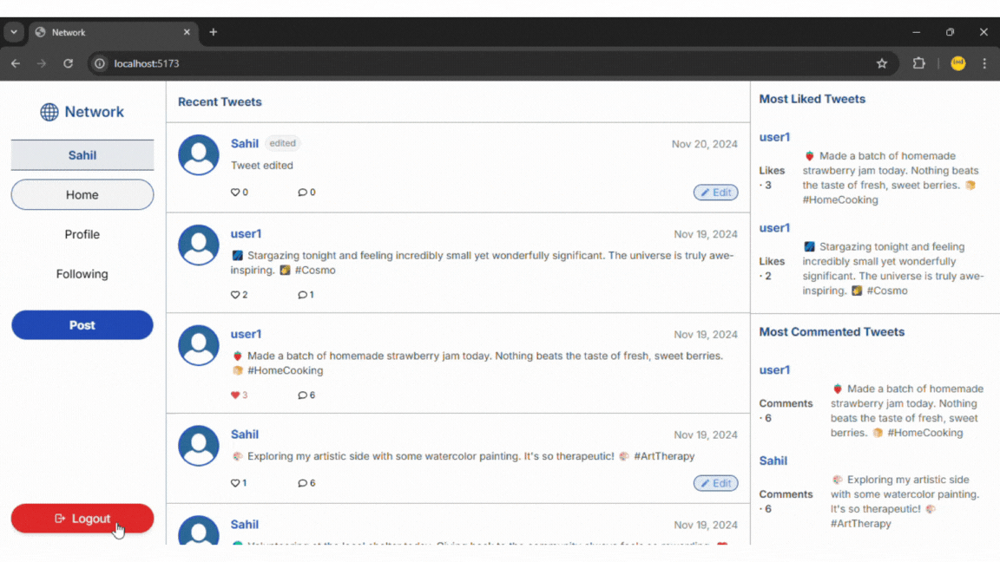
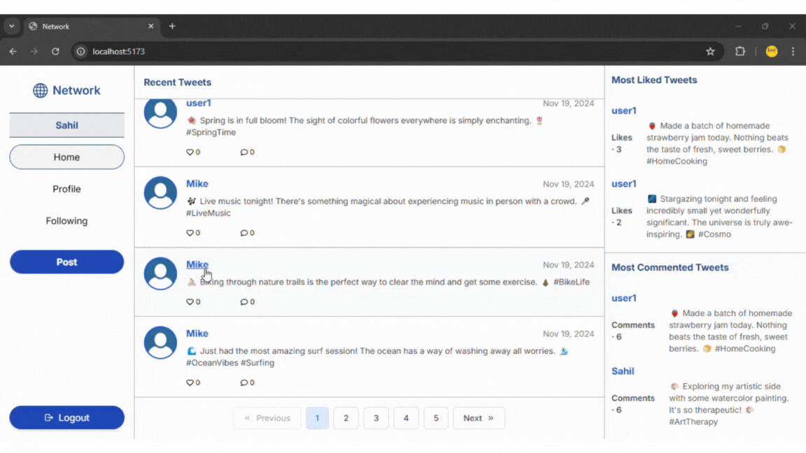

# Network

### Django+React

## Description

A Twitter-like social network website for making posts and following users.

## Specification

1.Login, register and Logout users.

- 

- 

- 

  2.Homepage: Recent tweets, mostliked, mostcommented tweets with pagination and modal.

- 

  3.Tweet: Users can post tweet.

- 

  4.Edit: Users can edit their tweets.

- 

  5.Like-Unlike: Users can like post and unlike.

- 

  6.Comment: Users can comment on post.

- 

  7.Follow-Unfollow: Users can Follow and Unfollow people.

- 

  8.Profile Page: User specific posts, liked posts and comments, Followers and Following count will be visible here.

- 

  9.Following-page: Renders post of who you follow.

- 
